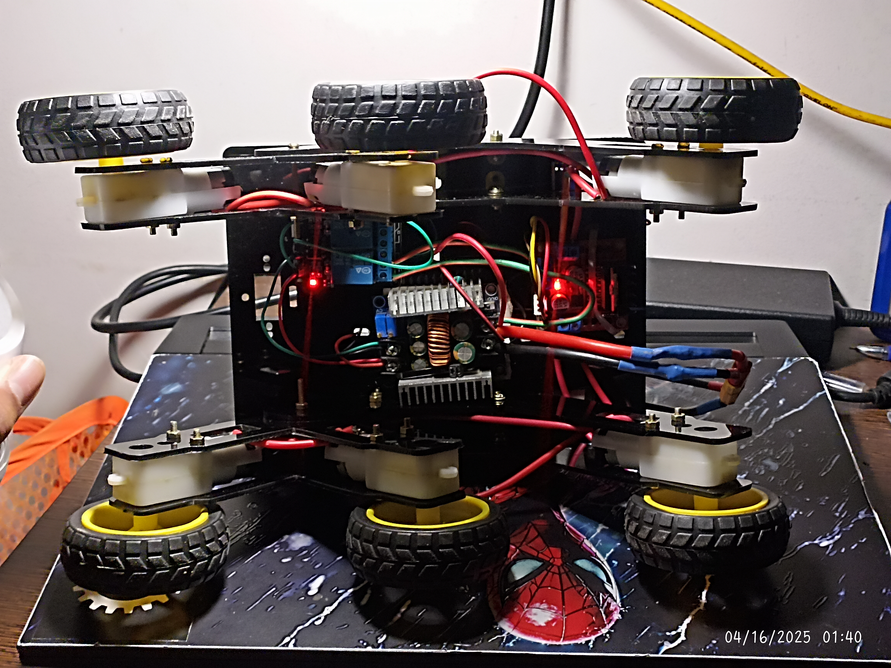
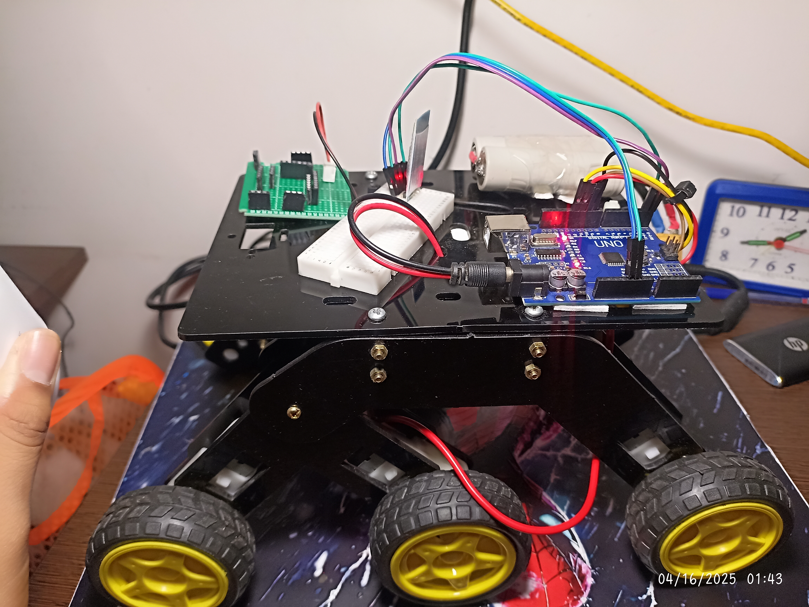

# Mars Rover Project

## Introduction
This project aims to develop an autonomous Mars rover capable of navigating rough terrain, collecting data, and performing various tasks using advanced robotics and AI. The rover is designed to simulate real-world Mars exploration scenarios and improve autonomous navigation, perception, and decision-making capabilities.

## Planning

##  New Update !!
### Electircal Part of the Rover is now figured out

